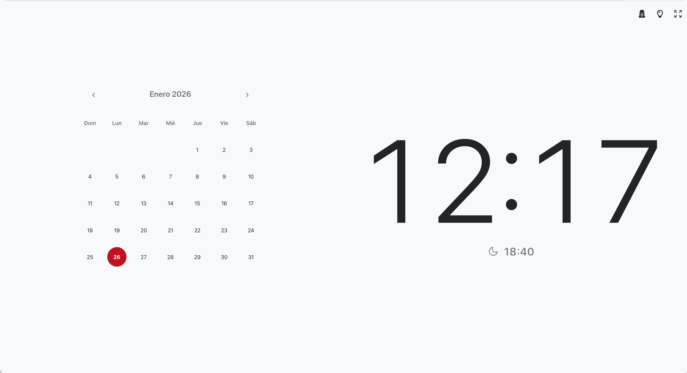
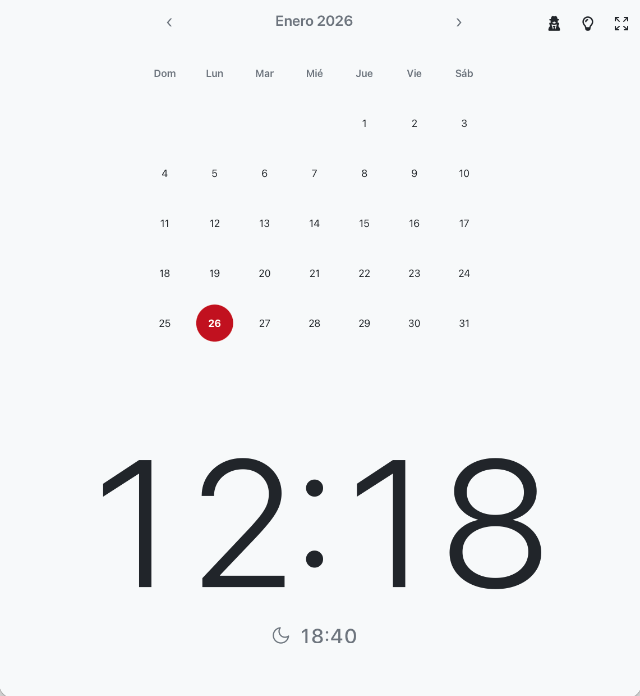

# ⏳ Web Fecha y Hora

Una aplicación web simple, elegante e instalable para mostrar la fecha y hora actuales, junto con un calendario interactivo y funcionalidades inteligentes como un modo oscuro/claro dinámico. Ideal para mantener a la vista la información horaria esencial con un diseño moderno.

## 📋 Índice

*   [🌟 Motivación](#-motivación)
*   [🚀 Demo en Vivo](#-demo-en-vivo)
*   [✨ Características Principales](#-características-principales)
*   [🛠️ Tecnologías Utilizadas](#-tecnologías-utilizadas)
*   [📦 Cómo Usar](#-cómo-usar)
*   [📸 Capturas de Pantalla](#-capturas-de-pantalla)
    *   [Diseño Horizontal](#diseño-horizontal)
    *   [Diseño Vertical](#diseño-vertical)
*   [🤝 Contribuciones](#-contribuciones)
*   [📄 Licencia](#-licencia)

## 🌟 Motivación

Este proyecto nace de la necesidad de dar una segunda vida a dispositivos Android más antiguos y desfasados, aprovechando las capacidades de las Tecnologías Web Progresivas (PWA) para ofrecer una herramienta funcional y visualmente atractiva, a pesar de las limitaciones de hardware. La meta es crear una aplicación que sea igualmente útil y compatible tanto con dispositivos antiguos (tablets Android) como con los ecosistemas modernos de Apple (iPhone, iPad, Mac), demostrando la versatilidad y el alcance de las tecnologías web.

## 🚀 Demo en Vivo

Puedes ver y probar la aplicación desplegada en GitHub Pages aquí:
[https://diegoiprg.github.io/dilware-tool-webFechaHora/](https://diegoiprg.github.io/dilware-tool-webFechaHora/)

## ✨ Características Principales

*   **Reloj en Tiempo Real:** Muestra la hora y los minutos actuales con actualizaciones dinámicas.
*   **Calendario Interactivo:** Un calendario del mes actual con navegación intuitiva entre meses y resaltado del día de hoy.
*   **Modo Oscuro/Claro Inteligente:**
    *   Cambio automático entre temas oscuro y claro basado en los horarios de amanecer y atardecer de tu ubicación (requiere permiso de geolocalización).
    *   Si la geolocalización no está disponible o se deniega, el sistema utiliza horarios fijos de día/noche.
    *   Opción manual para alternar el tema y persistencia de la preferencia.
*   **Modo Pantalla Completa:** Permite expandir la aplicación a pantalla completa para una experiencia inmersiva.
*   **Protección Anti-Quemado de Pantalla:** Mueve sutilmente el contenido principal cada pocos minutos para prevenir el efecto "burn-in" en pantallas.
*   **Aplicación Web Progresiva (PWA):** Instalable en tu dispositivo y funciona sin conexión a internet.
*   **Iconos SVG Dinámicos:** Los iconos de la interfaz se cargan dinámicamente en formato SVG y se adaptan al tema actual.
*   **Diseño Responsivo:** Se adapta fluidamente a diferentes tamaños y orientaciones de pantalla (vertical/horizontal).
*   **Registro de Depuración:** Un panel de depuración integrado que muestra eventos y errores de la aplicación.
*   **Integración con Google Analytics:** Seguimiento anónimo de interacciones para entender el uso de la aplicación (configurable).

## 🛠️ Tecnologías Utilizadas

*   **HTML5:** Estructura del contenido semántico.
*   **CSS3:** Estilos y diseño responsivo, utilizando variables CSS para un theming dinámico.
*   **JavaScript (Vanilla JS):** Toda la lógica de la aplicación implementada sin frameworks adicionales, haciendo uso intensivo de:
    *   **Geolocation API:** Para obtener la ubicación del usuario y calcular los tiempos de amanecer/atardecer.
    *   **Fullscreen API:** Para la funcionalidad de pantalla completa.
    *   **Service Worker API:** Para habilitar las características de PWA, como el funcionamiento offline y la instalación.
*   **Open-Meteo API:** Para obtener datos de amanecer y atardecer precisos basados en la ubicación geográfica.

## 📦 Cómo Usar

1.  **Visita la Demo:** Accede a la aplicación a través del enlace de GitHub Pages.
2.  **Instala (Opcional - Como PWA):** Puedes instalar esta aplicación directamente en tu dispositivo para una experiencia más integrada y acceso offline:
    *   **En Chrome (Escritorio/Android):** Busca el icono de "Instalar aplicación" en la barra de direcciones o en el menú del navegador.
    *   **En Safari (iOS/iPadOS):** Abre la aplicación en Safari, toca el icono de "Compartir" (el cuadrado con una flecha hacia arriba) y selecciona "Añadir a pantalla de inicio".
    *   **En Microsoft Edge:** Similar a Chrome, busca el icono de instalación en la barra de direcciones.
    Esto instalará la aplicación como una PWA (Progressive Web App) que podrás usar como cualquier otra aplicación nativa.
3.  **Explora las Funciones:** Utiliza los botones en la esquina superior derecha para alternar el modo oscuro, activar la pantalla completa o ver el log de depuración. Navega por el calendario haciendo clic en las flechas.

## 📸 Capturas de Pantalla

### Diseño Horizontal

_Vista del dashboard en orientación horizontal._

### Diseño Vertical

_Vista del dashboard en orientación vertical._

## 🤝 Contribuciones

Las contribuciones son bienvenidas. Si tienes alguna idea para mejorar la aplicación, no dudes en abrir un *issue*.

## 📄 Licencia

Este proyecto está bajo la Licencia Pública General GNU v3 (GPLv3). Consulta el archivo [`LICENSE`](LICENSE) para más detalles.